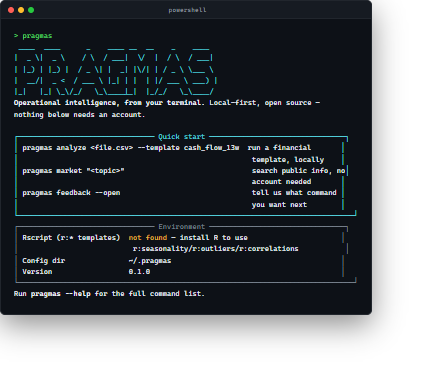
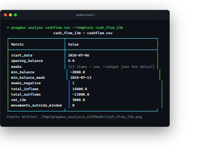
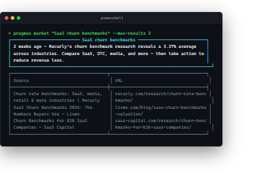
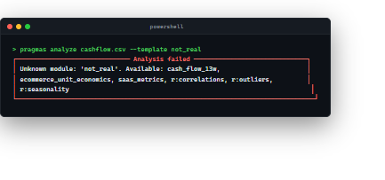

# PRAGMAS

**Financial analysis and market research, from your terminal — no account, no
setup, your data never leaves your machine.**

[](https://pypi.org/project/pragmas-cli/)
[](https://pypi.org/project/pragmas-cli/)
[](https://opensource.org/licenses/MIT)

## What is PRAGMAS?

[PRAGMAS](https://pragmas.io) is a platform that turns a company's own
documents and data — spreadsheets, PDFs, exports from whatever systems it
already uses — into answers and ready-to-share reports, without anyone having
to write SQL, build a dashboard, or learn a BI tool. Point it at your data,
ask a question in plain language, get a report back.

**This package is one piece of that platform, not the whole thing** — and it
happens to be the piece you can use right now, for free, without signing up
for anything. `pragmas-cli` runs a handful of PRAGMAS' financial-analysis
templates and its public-research tool directly on your computer. No PRAGMAS
account, no API key, no data ever sent to a PRAGMAS server. The rest of the
platform (the conversational agent, document ingestion, generated PDF/PPTX
reports) is a separate, closed-source, hosted product that this CLI will
grow into a client for later — see [What's next](#whats-next).

## What does this CLI actually do, today?

Two things, both real, both running on your machine:

1. **`pragmas analyze`** — feed it a CSV, get back a structured financial
   analysis: a 13-week cash flow projection, SaaS metrics (MRR bridge,
   churn, Rule of 40), e-commerce unit economics, or statistical templates
   (seasonality, outlier detection, correlation matrices) written in R. The
   math is the same math an analyst would do in a spreadsheet — this just
   does it in one command and hands you the numbers and a chart.
2. **`pragmas market`** — search public information on a topic (news,
   benchmarks, industry data) and get a short summary with sources. No
   account needed — it's a plain web search, nothing about your business
   is involved.

Everything else (`ask`, `ingest`, `report generate`, a live dashboard) is
what the rest of PRAGMAS does — those commands exist here as placeholders
so you can see the intended shape, and they tell you plainly that they're
not built into this CLI yet rather than pretending to work.

## Install

```bash
pip install pragmas-cli
```

Requires Python 3.9+. Installing `pragmas-cli` pulls in `pragmas-sdk`
automatically.

### Standalone binaries (no Python needed)

Each [GitHub Release](https://github.com/pragmasg/pragmas-cli/releases)
ships pre-built single-file binaries for Windows, Linux and macOS (Apple
Silicon) — download and run `pragmas` directly, no Python install required.

- `pragmas-windows-x64.exe`
- `pragmas-linux-x64`
- `pragmas-macos-arm64`

Notes:
- macOS binaries are unsigned — right-click → **Open** the first time to
  bypass Gatekeeper. Intel Macs: use `pip install pragmas-cli` (the binary
  is Apple Silicon only).
- The `r:*` templates still need `Rscript` installed on your machine even
  when using a binary (see below).

## Quickstart

Run `pragmas` with no arguments and you get a welcome screen: a banner, the
commands that work with zero setup, and whether `Rscript` is actually
installed on your machine — checked for real, not guessed.



Point `analyze` at a CSV — no signup, no API key, no internet connection to
anything PRAGMAS-owned:

```console
$ pragmas analyze cashflow.csv --template cash_flow_13w
```



`market` needs even less — not even a beta key:

```console
$ pragmas market "SaaS churn benchmarks" --max-results 3
```



Bad input doesn't crash — it tells you what's wrong and what your options
are:

```console
$ pragmas analyze cashflow.csv --template not_real
```



`login` is only relevant for the agent-backed commands further down (`ask`,
`ingest`, `report generate`) — `analyze` and `market` never need it.

## Commands

| Command | Runs | Status |
|---|---|---|
| `pragmas analyze <csv> --template <name> --output table\|json\|csv [--param k=v ...]` | locally | 🟢 works today, no network |
| `pragmas templates` / `pragmas templates show <name>` | locally | 🟢 works today, no network |
| `pragmas validate <csv> --template <name>` | locally | 🟢 works today, no network |
| `pragmas inspect <csv>` | locally | 🟢 works today, no network |
| `pragmas doctor [--check-api]` | locally (offline unless `--check-api`) | 🟢 works today |
| `pragmas market "<topic>" --max-results N --output table\|json\|md` | locally | 🟢 works today, no network |
| `pragmas feedback [--open]` | GitHub issues | 🟢 works today |
| `pragmas login --email you@example.com` | `POST /auth/beta-key` | 🟡 implemented backend-side, not deployed yet |
| `pragmas ask <query>` | agent (streaming) | ⚪ v0.2 — prints "not available yet" |
| `pragmas ingest <file>` | document upload | ⚪ v0.2 — prints "not available yet" |
| `pragmas report generate --project <id> --type <type>` | report generation | ⚪ v0.2 — prints "not available yet" |
| `pragmas tui` | interactive dashboard | ⚪ v0.2 — prints "not available yet" |

🟢 works today · 🟡 targets a real backend endpoint that isn't live in
production yet (works if you point `--base-url` at a backend you're running
yourself) · ⚪ intentionally stubbed, no backend contract targeted yet.

`analyze --template` accepts any name from `pragmas templates` — run it for
the current, always-accurate list (new templates in the SDK show up here
automatically, nothing to update in this CLI). As of this writing:
`cash_flow_13w`, `saas_metrics`, `ecommerce_unit_economics`, `data_profile`,
`sales_pipeline`, `burn_rate_runway`, `cohort_analysis`, `board_report`,
`r:seasonality`, `r:outliers`, `r:correlations`. The `r:*` templates need
`Rscript` installed **on your own machine** — everything else needs nothing
beyond `pip install`. Unknown templates, missing files, or missing `Rscript`
all produce a clear message and a non-zero exit code, never a crash — see
the error example above. `pragmas validate <csv> --template <name>` checks
your columns match before you run anything; `pragmas inspect <csv>`
suggests which templates a CSV might fit without knowing one up front.

### Why analyze/market are local, not "coming soon on the server"

They're deterministic — no LLM, no proprietary model — so there's no reason
to route them through a server: it would only add latency, a network
dependency, and cost for no benefit, and a public zero-auth endpoint like
`market` is real abuse surface for a hosted service with nothing to gain by
hosting it. `ask`, `ingest`, `report generate`, and `tui` are different: they
genuinely need the agent, RAG, and document storage, which can't run
meaningfully offline. Those exist as real commands today and fail loudly and
clearly rather than pretending to work, pointing you at `pragmas feedback`
instead.

### Configuration

Credentials from `pragmas login` are stored in `~/.pragmas/credentials.json`.
Override with environment variables when you need to:

| Variable | Purpose |
|---|---|
| `PRAGMAS_BASE_URL` | API root for `login`/future agent commands (defaults to `https://api.pragmas.io`) |
| `PRAGMAS_BETA_KEY` | Skip the credentials file, e.g. in CI |
| `PRAGMAS_CONFIG_DIR` | Override `~/.pragmas` |

## Give feedback

This CLI exists to collect feedback on command design before the platform
goes GA — that's what `pragmas feedback` is for. Run it, or
[open an issue](https://github.com/pragmasg/pragmas-cli/issues) directly.

## What's next

`ask`, `ingest`, `report generate`, and `tui` become real once the agent/RAG
path has been verified end-to-end in production and a real backend is live —
`pragmas login` itself already works against a backend you run yourself (the
endpoint exists, it's just not deployed publicly yet). `analyze`/`market` are
staying local for good — see
[`pragmas-sdk`'s CONTRACT.md](https://github.com/pragmasg/pragmas-sdk/blob/main/CONTRACT.md)
for why.

## Development

```bash
# from a checkout of both repos as siblings
git clone https://github.com/pragmasg/pragmas-sdk.git
git clone https://github.com/pragmasg/pragmas-cli.git

cd pragmas-sdk && pip install -e .
cd ../pragmas-cli && pip install -e ".[dev]"
pytest
```

`analyze`/`market` tests run for real (pandas/matplotlib, a fake DuckDuckGo
backend) via Typer's `CliRunner`; `login` mocks the HTTP layer with
[`respx`](https://lundberg.github.io/respx/) — no live backend required
either way.

## Contributing

New commands, flags, output formatting, and error-handling improvements are
welcome. Most new *capabilities* (analysis templates, connectors) belong in
[`pragmas-sdk`](https://github.com/pragmasg/pragmas-sdk) instead — this repo
should consume the SDK, not duplicate its logic. See
[CONTRIBUTING.md](./CONTRIBUTING.md) for the full guide: what's open today,
dev setup, and the PR process.

## License

MIT — see [LICENSE](./LICENSE).
